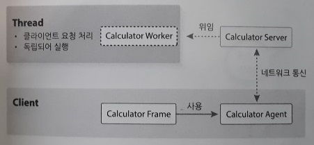

1단원. 웹 애플리케이션의 이해
=====
* 예제 코드
- - -
## 목차
1. [요약](#요약)
2. [참고](#참고)

## 요약
이번 장에서는 계산기 예제를 통해 단계별로 데스크톱 애플리케이션에서부터 클라우드 서비스의 근간이 되는 웹 애플리케이션으로 진화하는 과정을 확인해본다(코드는 테스트 수준에서만 실행해보고 전체적인 숲을 이해하고 넘어가면 된다).

* 데스크톱 애플리케이션
	* 기능 추가/변경 시 배포가 번거로움
	* 데이터베이스 접속이 필요한 애플리케이션은 보안에 취약(회사 내 PC가 아니라 외부 PC에 설치하는 경우)
* 클라이언트·서버 애플리케이션  
	 
	* 기능 추가/변경 유연 대처 가능(∵ 서버만 변경)
	* 다중 접속 불가(∵ 한 번에 하나의 클라이언트하고만 연결)
* 다중 클라이언트 요청 처리  
	 
	* 다중 클라이언트 요청 처리(∵ 멀티 스레드 방식 적용)
	* 코드가 복잡해진다는 단점(∵ 네트워크 및 스레드 프로그래밍 추가)
* 진화된 클라이언트·서버 애플리케이션
	* 전통적 C/S 구조  
		 
		* 데이터 일관성 관리 가능
	* 개선된 C/S 구조  
		 
		* 클라이언트는 오직 사용자와의 상호작용을 처리하는 UI만 담당(∵ 클라이언트의 업무 처리 부분을 서버로 이관)
* 웹 애플리케이션  
	 
	* 클라이언트와의 통신은 웹 서버가 전담 → 네트워크 및 멀티 스레드 프로그래밍으로부터 탈출
	* 애플리케이션 서버는 애플리케이션 실행 및 관리에 집중
	* 네트워크 오버헤드 발생(∵ UI 렌더링) → AJAX(Asynchronous JavaScript and XML)

이제 기존 C/S 환경과 웹 환경을 구체적으로 비교해보자.

* 기존 C/S 환경  
	 
* 웹 환경  
	 

즉 기존 C/S 환경에서는 업무가 변경되면 UI도 변경되어야 했기 때문에 클라이언트 프로그램을 다시 설치해야 했다. 하지만 웹 환경에서는 서버쪽만 바꾸면 된다. 다만, 웹 환경에서는 애플리케이션을 실행할 때마다 UI 로직을 내려받아야 하기 때문에 네트워크 오버헤드가 발생한다. 웹 브라우저가 설치되어 있고 인터넷이 연결되어 있다는 가정 하에 웹 애플리케이션의 실행 과정은 아래와 같다.

 

마지막으로 좀 더 구체적인 아키텍처는 아래와 같다.

* 기존 C/S 환경  
	 
* 웹 환경  
	 

웹 환경에서는 웹 브라우저와 웹 서버가 네트워크 및 멀티 스레드 프로그래밍을 해주기 때문에 개발자는 단지 어떤 업무를 처리하고 무엇을 출력할 것인가에 대해서만 고민하면 된다.

##### [목차로 이동](#목차)

## 참고

##### [목차로 이동](#목차)