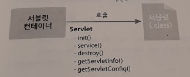
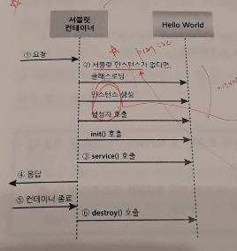
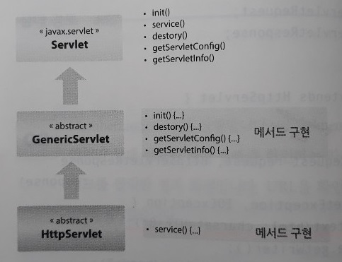
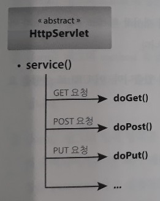

3단원. 서블릿 프로그래밍
=====
## 목차
1. [요약](#요약)
2. [참고](#참고)
	* [웹 애플리케이션 배치](#웹-애플리케이션-배치)
	* [Servlet 클래스 계층도](#Servlet-클래스-계층도)

## 요약
이번 장에서는 자바로 웹 애플리케이션을 만드는 방법에 대해 언급한다.

* CGI 규칙  
	 
* 서블릿과 서블릿 컨테이너  
	 

CGI란 무엇인가? 사용자가 웹 서버를 통해 간접적으로 실행**시키는**(∵ 제어 역전) 프로그램이 웹 애플리케이션이다. 웹 서버는 클라이언트가 요청한 프로그램을 찾아서 실행하고, 해당 작업을 수행한 후 그 결과를 웹 서버에 돌려준다. 그러면 웹 서버는 그 결과를 HTTP 형식에 맞추어 웹 브라우저에게 보낸다. 이때 웹 서버와 프로그램 사이에 데이터를 주고받는 규칙을 CGI(Common Gateway Interface)라고 한다.

자바 CGI 프로그램을 서블릿(Servlet)이라고 부르며 C/C++처럼 컴파일 방식이다. 다만 자바 서블릿이 다른 CGI 프로그램과 다른 점은 웹 서버와 직접 데이터를 주고 받지 않으며 전문 프로그램에 의해 관리된다는 것이다. 바로 이 전문 프로그램을 서블릿 컨테이너(Servlet Container)라고 한다. 이는 서블릿의 생성과 실행, 소멸 등 생명주기를 관리하는 프로그램으로 서블릿을 대신하여 CGI 규칙에 따라 웹 서버와 데이터를 주고 받는다. 따라서 서블릿 개발자는 더 이상 CGI 규칙에 대해 알 필요가 없고 서블릿 컨테이너와 서블릿 사이의 규칙을 알아야 한다.

> 웹 애플리케이션 서버(WAS) ⊃ 서블릿 컨테이너

C/S 시스템 구조에서 서버 쪽 애플리케이션의 생성과 실행, 소멸을 관리하는 프로그램을 애플리케이션 서버라고 한다. 그중 웹 기술을 기반으로 동작되는 애플리케이션 서버를 WAS(Web Application Server)라고 한다. 한편 Java에서 말하는 WAS란, Java EE 기술 사양을 준수하여 만든 Java EE 구현체(Implementation)이라고도 말한다. 그리고 Java EE 기술 중에서 서블릿, JSP 등 웹 관련 부분만 구현한 서버를 서블릿 컨테이너라고 부른다(∴ 서블릿이나 JSP 프로그래밍을 할 때는 사용하는 제품 즉, 서블릿 컨테이너가 어떤 버전의 Java EE 구현체인지 확인 후 버전에 맞추어 API를 사용해야 한다). 예로는 아파치 재단의 톰캣, 오픈 프로젝트 Jetty 등이 있다.

본격적으로 자바 CGI, 즉 서블릿 프로그래밍을 해보자. 서블릿 컨테이너가 서블릿에 대해 호출할 메서드를 정의한 것이 Servlet 인터페이스다. 따라서 서블릿 클래스는 반드시 javax.servlet.Servlet 인터페이스를 구현해야 한다.

 

Servlet 인터페이스에 정의된 다섯 개의 메서드 중에서 서블릿의 생성과 실행, 소멸, 즉 생명주기 Lifecycle과 관련된 메서드가 init(), service(), destroy()다.

* init()
	* 서블릿 컨테이너가 서블릿을 생성한 후 초기화 작업을 수행하기 위해 호출하는 메서드
	* ∴ 클라이언트 요청을 처리하기 전 준비할 작업
* service()
	* 클라이언트가 요청할 때마다 호출되는 메서드
	* ∴ 실질적인 서비스 작업 수행
* destroy()
	* 서블릿 컨테이너 종료, 웹 어플리케이션이 멈출 때, 또는 해당 서블릿을 비활성화시킬 때 호출
	* ∴ 서비스 수행 위해 확보했던 자원 해제 혹은 데이터 저장 등 마무리 작업 작성

즉 서블릿의 구동 절차는 다음과 같다.

 

* 클라이언트의 요청이 들어오면 서블릿 컨테이너는 서블릿을 찾는다(web.xml).
* 만약 서블릿이 없다면, 서블릿 클래스를 로딩하고 인스턴스를 준비한 후 생성자를 호출한다(`????`).
* 서블릿 초기화 메서드인 init()를 호출한다.
* 클라이언트의 요청을 처리하는 service() 메서드를 호출한다.
* service() 메서드에서 만든 결과를 HTTP 프로토콜에 맞추어 클라이언트에 응답함으로써 요청처리를 완료한다.
* 시스템 운영자가 서블릿 컨테이너(WAS)를 종료한다면 생성된 모든 서블릿에 대해 destroy() 메서드 호출(∵ 컨테이너 종료 전에 서블릿이 마무리 작업을 수행해야 함)

여기서 중요한 점은 서블릿 인스턴스는 하나만 생성되어 웹 애플리케이션이 종료될 때까지 사용된다는 점이다. 즉 한 번 서블릿 객체가 생성되면 웹 애플리케이션을 종료할 때까지 계속 유지하므로 코딩 시 다음을 준수해야 한다.

* 인스턴스 변수에 특정 사용자를 위한 데이터를 보관해서는 안 된다.
* 클라이언트가 보낸 데이터를 일시적으로 보관하기 위해 서블릿의 인스턴스 변수를 사용해서도 안 된다.

##### [목차로 이동](#목차)

## 참고
* [서블릿과 서블릿 컨테이너](https://engkimbs.tistory.com/161)

##### [목차로 이동](#목차)

### 웹 애플리케이션 배치
p132-142

##### [목차로 이동](#목차)

### Servlet 클래스 계층도
지금까지는 서블릿 클래스를 만들 때 Servlet 인터페이스를 구현했다(∵ 서블릿 컨테이너는 Servlet 규칙에 정의된 메서드를 호출하기 때문에, 서블릿 객체는 반드시 Servlet 인터페이스를 구현해야 한다). 따라서 우리는 서블릿을 만들 때마다 Servlet 인터페이스에 선언된 다섯 개의 메서드를 모두 구현하였다. 하지만 이 메서드 중 반드시 구현해야 하는 메서드는 service() 뿐이다. 서블릿을 만들 때 Servlet 인터페이스 대신 GenericServlet 추상 클래스를 상속받는다면 Servlet 인터페이스 중에서 service()만 구현하면 된다. 따라서 Servlet 인터페이스를 직접 구현하던 때보다 코드가 훨씬 간결해진다. 한편 GenericServlet 클래스 대신 HttpServlet 클래스를 상속받을 수도 있다. HttpServlet 클래스는 GenericServlet 클래스의 하위 클래스이므로 HttpServlet을 상속받으면 GenericServlet과 마찬가지로 javax.servlet.Servlet 인터페이스를 구현한 것이 된다. HttpServlet은 GenericServlet과 달리 service() 메서드를 직접 구현한다기보다는 클라이언트의 요청 방식에 따라 doXXX() 메서드를 오버라이딩한다.

* HttpServlet의 클래스 계층도  
	 
* HttpServlet의 service() 호출  
	 
	* 클라이언트의 요청이 들어오면, 첫째로 상속받은 HttpServlet의 service() 메서드 호출
	* 둘째로 service()는 클라이언트 요청 방식에 따라 doGet(), doPost(), doPut() 등의 메서드 호출

##### [목차로 이동](#목차)
