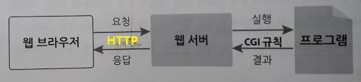
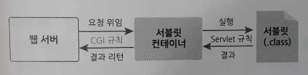

3단원. 서블릿 프로그래밍
=====
## 목차
1. [요약](#요약)
2. [참고](#참고)

## 요약
이번 장에서는 자바로 웹 애플리케이션을 만드는 방법에 대해 언급한다.

* CGI 규칙  
	 
* 서블릿과 서블릿 컨테이너  
	 

CGI란 무엇인가? 사용자가 웹 서버를 통해 간접적으로 실행**시키는**(∵ 제어 역전) 프로그램이 웹 애플리케이션이다. 웹 서버는 클라이언트가 요청한 프로그램을 찾아서 실행하고, 해당 작업을 수행한 후 그 결과를 웹 서버에 돌려준다. 그러면 웹 서버는 그 결과를 HTTP 형식에 맞추어 웹 브라우저에게 보낸다. 이때 웹 서버와 프로그램 사이에 데이터를 주고받는 규칙을 CGI(Common Gateway Interface)라고 한다.

자바 CGI 프로그램을 서블릿(Servlet)이라고 부르며 C/C++처럼 컴파일 방식이다. 다만 자바 서블릿이 다른 CGI 프로그램과 다른 점은 웹 서버와 직접 데이터를 주고 받지 않으며 전문 프로그램에 의해 관리된다는 것이다. 바로 이 전문 프로그램을 서블릿 컨테이너(Servlet Container)라고 한다. 이는 서블릿의 생성과 실행, 소멸 등 생명주기를 관리하는 프로그램으로 서블릿을 대신하여 CGI 규칙에 따라 웹 서버와 데이터를 주고 받는다. 따라서 서블릿 개발자는 더 이상 CGI 규칙에 대해 알 필요가 없고 서블릿 컨테이너와 서블릿 사이의 규칙을 알아야 한다.

p105.

##### [목차로 이동](#목차)

## 참고
* [서블릿과 서블릿 컨테이너](https://engkimbs.tistory.com/161)

##### [목차로 이동](#목차)
